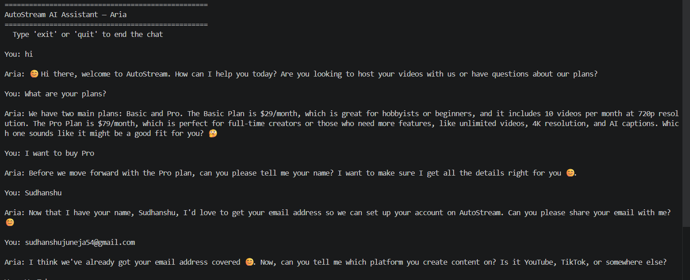
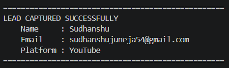

# AutoStream AI Assistant — Aria

An intelligent conversational AI agent built using LangGraph that converts user conversations into qualified leads.

---

## Features

* Intent Detection (Greeting / Inquiry / High Intent)
* Conversational Memory using SQLite
* Knowledge-based Responses (Pricing & Policies)
* Lead Capture Workflow (Name, Email, Platform)
* Tool Execution (Mock Lead API)
* Multi-turn conversation handling

---

## How It Works

1. User sends a message
2. Agent classifies intent
3. If general query → responds using knowledge base
4. If high intent → starts lead collection flow
5. Once all details collected → triggers lead capture tool

---

## Architecture

* **LLM**: Groq (llama-3.3-70b-versatile)
* **Framework**: LangGraph
* **Memory**: SQLite (`state_db.sqlite`)
* **Flow**:

  * Intent Classifier Node
  * RAG Node (Knowledge-based responses)
  * Lead Capture Node

---

## Project Structure

```
autostream-ai/
│
├── main.py
├── knowledge_base.md
├── requirements.txt
├── .env
├── state_db.sqlite
```

---

## Setup Instructions

### 1. Clone the repo

```
git clone [](https://github.com/sudhanshujunejalinkedin/autostream-ai)
cd autostream-ai
```

### 2. Install dependencies

```
pip install -r requirements.txt
```

### 3. Add API Key

Create `.env` file:

```
GROQ_API_KEY=your_api_key_here
```

### 4. Run the project

```
python main.py
```

---

## Sample Conversation

```
You: Hi
Aria: 😊 Hi there, welcome to AutoStream. How can I help you today? Are you looking to host your videos with us or have questions about our plans?

You: What are your plans?
Aria: We have two main plans: Basic and Pro. The Basic Plan is $29/month, which is great for hobbyists or beginners, and it includes 10 videos per month in 720p resolution. Our Pro Plan is $79/month, which is perfect for full-time creators or those who need more features like unlimited videos, 4K resolution, and AI captions. Which one sounds like it might fit your needs? 🤔

You: I want to buy Pro
Aria: Before we get started with the Pro plan, can you tell me a bit about yourself? What's your name? 😊

You: Sudhanshu
Aria: You've already shared your name with me, thanks for that 😊. Now, I just need to know a bit more about how we can get in touch with you. Can you please share your email address with me?

You: sudhanshujuneja54@gmail.com
Aria: You've already shared your email with me. Now, I just need to know which platform you create content on. Are you on YouTube, TikTok, or somewhere else? 🤔

You: YouTube
Aria: You're all set, sudhanshu!
Our team will reach out to you at sudhanshujuneja54@gmail.com shortly to get your Pro plan activated. Welcome to AutoStream

```

---

## Demo Screenshots

### Terminal Chat Interface



### Lead Capture Output



---

## 📌 Notes

* This implementation uses a **lightweight RAG approach** with a local knowledge base.
* Memory is persisted using SQLite for multi-turn conversations.
* Lead capture is triggered based on **user intent**, not just queries.

---

## WhatsApp Integration (Concept)

To deploy this on WhatsApp:

1. Use **Twilio WhatsApp API**
2. Set up a webhook endpoint (Flask/FastAPI)
3. Receive incoming messages
4. Pass message to agent
5. Return AI response back to user


---

## Author

Sudhanshu Juneja


